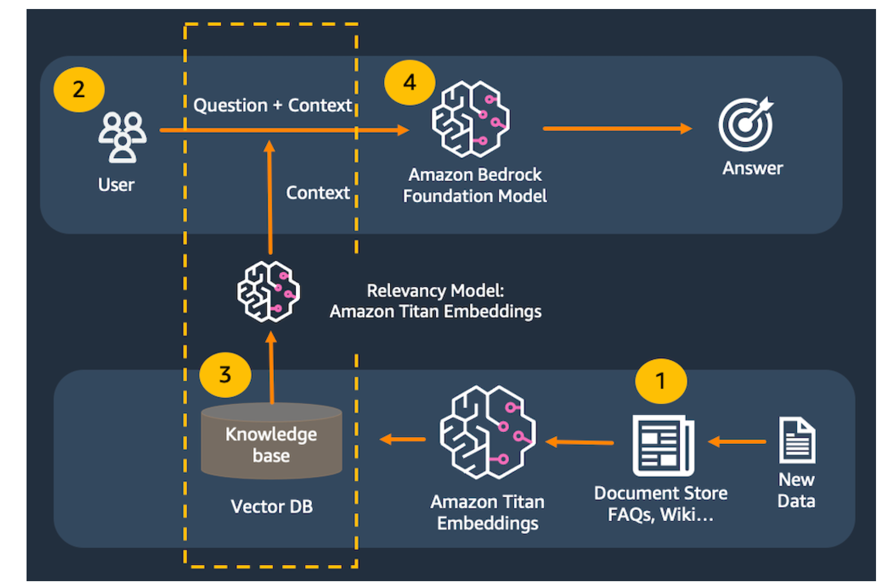
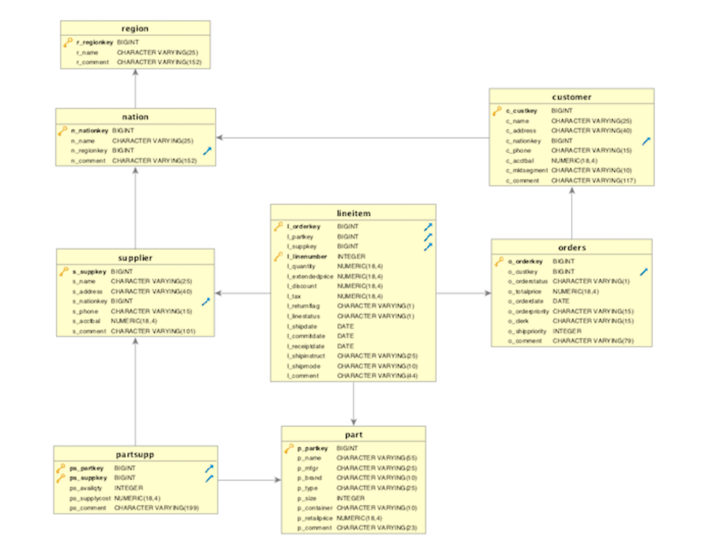

## Sql-querying-tools-rag-bedrock-samples-app

## Title

Build a powerful Natural language SQL querying tool with rag leveraging GenAI using Amazon Bedrock for Enterprise Business users 

## Introduction

This repository contains the source code for use cases in which Streamlit applications interact with a Large Language Model (LLM) using the Langchain framework, as well as for text-to-SQL tasks employing Amazon Bedrock and the titan-tg1-large LLM.

[Amazon Bedrock](https://aws.amazon.com/bedrock/) is a fully managed service designed for utilizing foundation models, providing a unified set of APIs for accessing models from Amazon and third-party sources, catering to both text and image generation.

[LangChain](https://python.langchain.com/docs/get_started/introduction) offers convenient functions for interacting with Amazon Bedrock's models and associated services such as vector databases. It provides Python and JavaScript libraries, and for the purposes of this workshop, we will utilize the Python version of LangChain.

[Streamlit](https://streamlit.io/) empowers us to rapidly develop web interfaces for our Python code, eliminating the need for front-end development expertise. Streamlit is particularly valuable for creating proof-of-concept applications that can be shared with a broad audience, spanning both technical and non-technical individuals.

In this repository, we will utilize LangChain to develop generative AI prototypes by leveraging Amazon Bedrock. The provided source code will guide viewers in building a robust natural language SQL querying tool, powered by GenAI through Amazon Bedrock. This tool is intended for enterprise business users, including those who may not be proficient in writing SQL but possess business knowledge about the enterprise, with limited technical attribute knowledge.

This source code is designed to equip you with the necessary knowledge and skills to effectively utilize the libraries and models, enabling you to create prototypes for a wide range of use cases.

Once you have completed the prerequisites section, you are free to proceed with the labs in any order.

### Target audience and outcomes

The intended audience for this source code encompasses architects, software developers, product managers, and individuals with an interest in constructing generative AI applications. While a background in software development or familiarity with AWS services can be advantageous, it is not a prerequisite for participating in this workshop. Moreover, no prior experience in data science is necessary.
 
### Account allowlisting
To run this source code, your account must be included on the Amazon Bedrock allowlist. Please ensure that your account is activated and allowlisted before executing this source code.

### Supported Regions
This source code is meant to be run in any region where your Bedrock access has been enabled.

 
### Costs when running from your own account
If you are running this in your own account, please be aware that costs may be incurred. The exact expenses depend on factors such as the frequency of your calls to Bedrock, the length of tokens or the size of images in your calls, and the specific models you utilize. For detailed pricing information for each model, please refer to the Amazon Bedrock console.

### Time to complete

Executing this source code should take approximately 30 minutes to complete.

### Solution overview

In this source code, we will build a simple powerful Natural language SQL querying tool application with Titan Text, Titan Embeddings, LangChain, and Streamlit.

Large language models are prone to hallucination, which is just a fancy word for making up a response. To correctly and consistently answer questions, we need to ensure that the model has real information available to support its responses. We use the Retrieval-Augmented Generation (RAG) pattern to make this happen.

With Retrieval-Augmented Generation, we first pass a user's prompt to a data store. This might be in the form of a query to Amazon Kendra . We could also create a numerical representation of the prompt using Amazon Titan Embeddings to pass to a vector database. We then retrieve the most relevant content from the data store to support the large language model's response.

In this source code, we will use an in-memory FAISS  database to demonstrate the RAG pattern. In a real-world scenario, you will most likely want to use a persistent data store like Amazon Kendra or the vector engine for Amazon OpenSearch Serverless .

##### High level architecture 



A document is broken up into chunks of text. The chunks are passed to Titan Embeddings to be converted to vectors. The vectors are then saved to the vector database.

    > The user submits a text.

    > The input text is converted to a vector using Titan Embeddings, then matched to the closest vectors in the vector database.

    > The combined content from the matching vectors + the original text are then passed to the model to get the best answer in SQL format. 

    > This application consists of two files: one for the Streamlit front end, and one for the supporting library to make calls to Amazon Bedrock.


##### High level database architecture

> [!NOTE]
> 8 tables from TPC Benchmark data model



> [!NOTE]
> See sourcecode/redshift_table_definition.pdf to find out DDL statement of all the tables.

### Getting Started

#### In your own AWS account

1. Prerequisite 

    > AWS Console access 

    > Amazon Bedrock access

    > AWS Cloud9 Setup access

2. AWS Cloud9 Setup

To run this source code, we will utilize [AWS Cloud9](https://aws.amazon.com/cloud9/) as our integrated development environment. AWS Cloud9 is one of the options available for building applications with Amazon Bedrock. Alternatively, you can also use your preferred development tools such as VS Code, PyCharm, [Amazon SageMaker Studio](https://aws.amazon.com/sagemaker/studio/), or Jupyter Notebooks.

> [!NOTE]
> AWS Cloud9 will be executed within the same AWS account and region where Bedrock has been enabled.
> The AWS account and region are configured with a default VPC, in accordance with AWS defaults.

3. In the **AWS console**, select the region that has **Amazon Bedrock** enabled.

4. In the AWS console, search for *Cloud9*. Select **Cloud9** from the search results.

5. Select **Create environment**.

6. Set the **environment** details. Set **Name** to **demo-bedrock-env**.

7. Set the **EC2 instance** details. Set **Instance** type to **t3.small**. Set **Platform to **Ubuntu Server 22.04 LTS**. Set **Timeout** to **4 hours**.

8. Select the **Create** button.

9. Wait for the **environment** to be created.

10. You should get a "**Successfully created demo-bedrock-env**" message in the top banner when ready.In the Environments list, click the Open link. This will launch the AWS Cloud9 IDE in a new tab.

11. Confirm that the **AWS Cloud9** environment loaded properly.You can close the **Welcome** tab.

> [!NOTE]
> You can drag tabs around to the position you want them in. In this example, the bash terminal tab was dragged up to the top tab strip, and the bottom-aligned panel was closed. 

### Download and configure the assets for the labs

1. In the AWS Cloud9 IDE, select the **bash terminal**.

2. Install the dependencies for the labs.

```py

pip3 install faiss-cpu transformers Pillow pypdf langchain streamlit

```

3. Download the Bedrock-specific libraries

```py

curl https://d2eo22ngex1n9g.cloudfront.net/Documentation/SDK/bedrock-python-sdk.zip --output bedrock-python-sdk.zip
unzip bedrock-python-sdk.zip -d bedrock-python-sdk
cd bedrock-python-sdk
ls *.whl -l


```

4. Install the Bedrock preview build of boto3 and botocore.

```py

pip3 install botocore-*-py3-none-any.whl
pip3 install boto3-*-py3-none-any.whl
pip3 install awscli-*-py3-none-any.whl
cd ../

```

5. Configure environment variables. 

```py

# If you were provided with a custom endpoint URL, set that using the command blueprint below:

export DEMO_ENDPOINT_URL=https://IF_YOU_WERE_PROVIDED_A_SPECIAL_ENDPOINT_URL_IT_GOES_HERE.com

```

```py

# If you need to override the default region (Bedrock is enabled in a different region than AWS Cloud9), set that using the command blueprint below, ex: us-east-1 or us-west-2. 

export DEMO_REGION_NAME=REGION_NAME_GOES_HERE_IF_YOU_NEED_TO_OVERRIDE_THE_DEFAULT_REGION

```

```py

# You can run the following commands to confirm that your environment variables are set properly:

echo $DEMO_ENDPOINT_URL
echo $DEMO_REGION_NAME

``` 

6. pull the source code from below git hub link. 

```py

git pull commands 

```

7. Run the streamlit command from the terminal. 

> [!NOTE]
> Ignore the Network URL and External URL links displayed by the Streamlit command. Instead, we will use AWS Cloud9's preview feature.

```py 

streamlit run text_to_sql_rag_app.py --server.port 8080

```

8. In **AWS Cloud9**, select **Preview** -> **Preview Running Application**.

9. Try out some prompts and see the results. 

    > write a sql code to find out total number of supplier for each region

    > write a sql code to find out total number of customer for each region order different parts


10. Close the preview tab in **AWS Cloud9**. Return to the **terminal** and press **Control-C** to exit the application.

## Clean up 

    > In the **AWS Cloud9** console, select the radio button by the **demo-bedrock-env** item, the select the **Delete** button.

    > In the **Delete** confirmation dialog, type *Delete* into the confirmation text box, then select the **Delete** button.

    > Wait several minutes while the **demo-bedrock-env** environment is deleted.

    > You should see a banner confirming that the environment was deleted.


## Security

See [CONTRIBUTING](CONTRIBUTING.md#security-issue-notifications) for more information.

## License

This library is licensed under the MIT-0 License. See the LICENSE file.